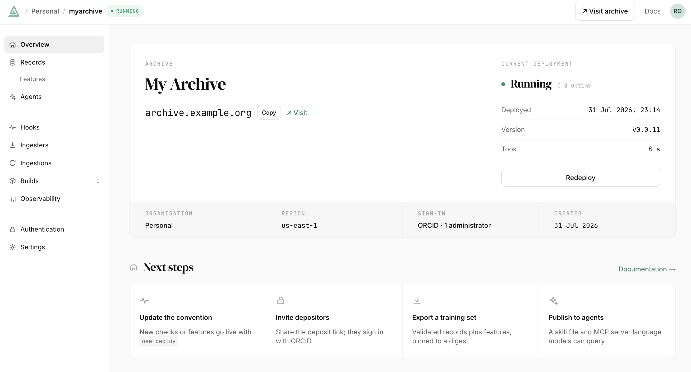

<p align="center">
  
</p>

<h1 align="center">Open Science Archive</h1>

<p align="center">
  <strong>An open source platform for AI-ready scientific data</strong>
  <br /><br />
  <a href="https://github.com/opensciencearchive/osa-py"></a>
  <a href="https://github.com/opensciencearchive/server/issues"></a>
  <a href="LICENSE"></a>
</p>

> **⚠️ Under active development.** OSA is pre-release software. APIs, data formats, and configuration will change without notice. Not yet suitable for production use or external contributions.

---

## What is OSA?

OSA is an open source platform for publishing scientific data: depositing it, validating it, and making it findable and usable once it's published. It gives any field the kind of data infrastructure [PDB](https://www.rcsb.org/) gives structural biology, without having to build it first.

You describe your data once, as a **convention**: what a record looks like, where the data comes from today, and what you want computed from it. OSA turns that into a running archive, validated on the way in, queryable on the way out, and documented well enough that a colleague or an AI assistant can find their way around it.

<table>
<tr>
<td width="50%">

**Describe your data in Python**
A schema, an ingester, and your analysis code, deployed with one command. No YAML archaeology, no bespoke ETL.

**Your analysis code, reproducibly**
You write the quality checks and the derived measurements; OSA runs them in a sandbox and records exactly which version of your code produced every row.

</td>
<td width="50%">

**Built for AI assistants**
Every archive publishes a catalog, a plain-English brief on what it holds, and an endpoint an assistant can connect to, so asking questions of your data needs no integration work.

**Made to be shared**
Records carry stable, versioned identifiers, so data can move between archives without losing track of where it came from.

</td>
</tr>
</table>

## Quickstart

You don't need to clone this repo to run an OSA archive. The [Python SDK (`osa-py`)](https://github.com/opensciencearchive/osa-py) ships the whole stack (database, server, and dashboard), brought up with one command.

```bash
pip install osa-py
osa init my-archive
cd my-archive
osa start        # your archive is now running on http://localhost:8000
osa dashboard    # open the web dashboard, already signed in
```

There's no login step and nothing to configure. Add `--no-ui` to `osa start` if you want the API on its own.

## Define a convention

A convention is a Python package that declares a schema, its hooks, and an ingester, then registers itself through an `osa.conventions` entry point. In outline:

```python
from osa import Example, Field, Record, Schema, convention, hook

class PDBStructure(Schema):
    __schema_id__ = "pdb-structure"

    pdb_id: str = Field(description="RCSB PDB accession code.", examples=["1ABC"])
    method: str = Field(description="Experimental method used to solve the structure.")
    resolution: float | None = Field(default=None, unit="Å")

@hook
def find_pockets(record: Record[PDBStructure]) -> list[Pocket]:
    """Derive one row per detected binding pocket."""
    ...

convention(
    title="Protein Structures",
    description="Protein structures from the PDB, with pocket detection.",
    version="1.0.0",
    schema=PDBStructure,
    hooks=[find_pockets],
    ingester=PDBIngester,
    files={"accepted_types": [".cif", ".pdb"], "max_count": 5},
    purpose="What this dataset covers and what questions it answers.",
    examples=[Example(question=..., query=..., interpretation=...)],
)
```

```toml
# pyproject.toml
[project.entry-points."osa.conventions"]
pockets = "mypkg.convention"
```

Documenting your data is **required**, not optional. A convention has to say what it covers and give worked examples of the questions it answers; a deploy that skips this is rejected, and tells you what's missing. That documentation is what makes your archive legible to a colleague or an AI assistant, rather than a pile of columns.

Then deploy and ingest:

```bash
osa deploy                               # register the convention and build its hooks
osa ingestion start --convention pockets # pull from upstream and publish records
osa logs server -f                       # watch it run
```

`osa test` runs a convention end-to-end without touching your archive. The full SDK reference lives in the [`osa-py` README](https://github.com/opensciencearchive/osa-py).

## The read surface

Published records are served from a single `/data/` surface: browse what the archive holds, fetch one record, query with filters, or pull a whole table down as CSV.

```bash
curl http://localhost:8000/                                             # what this archive publishes
curl http://localhost:8000/api/v1/data                                  # the datasets and their tables
curl http://localhost:8000/api/v1/data/pdb-structure                    # one dataset: fields and row counts
curl 'http://localhost:8000/api/v1/data/pdb-structure/records?limit=3'  # records as JSON
curl http://localhost:8000/api/v1/data/pdb-structure/pocket.csv         # a derived table as CSV
```

Filters are expressed as JSON and run as a query against the database, so they stay fast on large tables:

```bash
curl -X POST http://localhost:8000/api/v1/data/pdb-structure/pocket \
  -H 'Content-Type: application/json' \
  -d '{"filter": {"kind": "predicate",
                  "field": "features.pocket.score",
                  "op": "gte", "value": 0.8},
      "limit": 5}'
```

### Agents

Your archive writes its own documentation. `/SKILL.md` is a plain-English brief on what the archive holds, kept in sync with the data as it grows. And `/mcp` is a [Model Context Protocol](https://modelcontextprotocol.io) endpoint you can add as a connector in Claude, ChatGPT, Goose, or VS Code:

```
http://localhost:8000/mcp
```

From there an assistant can answer questions about your data and draw tables and charts from it directly, without anyone writing an integration first. Your archive doesn't need an API key or a model of its own; the assistant connecting to it does that work.

## The dashboard

`osa dashboard` opens the web dashboard for your archive:

<p align="center">
  
</p>

<sub>Shown here for a deployed archive. Running locally, you get the same pages without the deployment and build panels.</sub>

## How data moves through OSA

```
Deposition  ─→  Validation  ─→  Curation  ─→  Record  ─→  /data
   draft          your hooks     approve/     immutable    queries, CSV dumps,
   metadata       run and         reject      versioned    AI assistants
   + files        check it                    published
```

## Hack on OSA

Working on the server or dashboard itself:

```bash
git clone https://github.com/opensciencearchive/server.git
cd server
just dev    # Postgres + server + dashboard + web, with hot-reload
```

Server tests: `cd server && just test`. Lint and type check: `just lint`.
Dashboard: `just dashboard dev`, `just dashboard test`.

```
.
├── server/                  # Python backend (FastAPI)
│   ├── osa/
│   │   ├── domain/          # DDD bounded contexts
│   │   ├── application/     # API routes, DI wiring
│   │   └── infrastructure/  # Adapters (DB, K8s, S3)
│   ├── tests/               # Unit + integration tests
│   ├── migrations/          # Alembic migrations
│   └── sources/             # Data source plugins
├── apps/
│   └── dashboard/           # Next.js management dashboard (operator UI)
├── packages/
│   └── osa-widgets/         # MCP Apps interactive UI bundles
├── web/                     # Next.js public archive site (deposit/search/record)
└── deploy/                  # Docker Compose orchestration
```

> The `web/` public site is currently out of date. It builds under `just dev` here, but is **not** started by `osa start`. It sits behind a `web` Compose profile there, so the default self-host stack is server + dashboard.

## Status

Running an archive locally works well today: `osa start` gets you a working stack with no configuration, and `osa dashboard` gives you a view of it. Getting data in (ingestion, validation, and publishing) works end to end, as does getting it back out through `/data` and the AI assistant endpoint. Both are in real use.

Curation currently auto-approves everything. Sharing between archives, usage analytics, and the public-facing archive site are still in progress.

## Demos

- [Protein Pocket Database](https://www.pockets.bio/)
- [Semantic GEO Database](https://www.lingual.bio/)

## License

Apache 2.0
